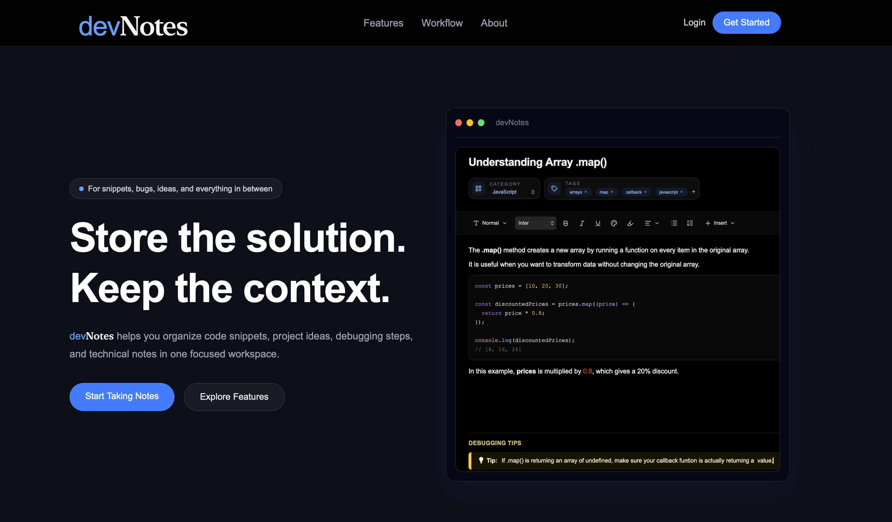
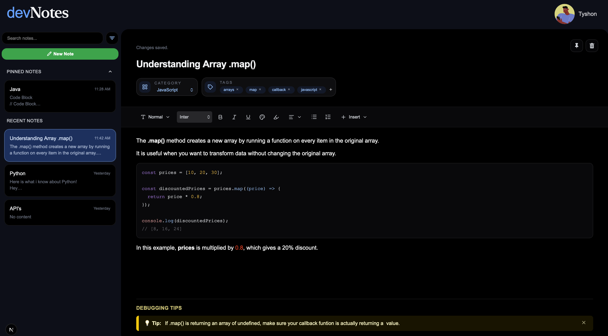
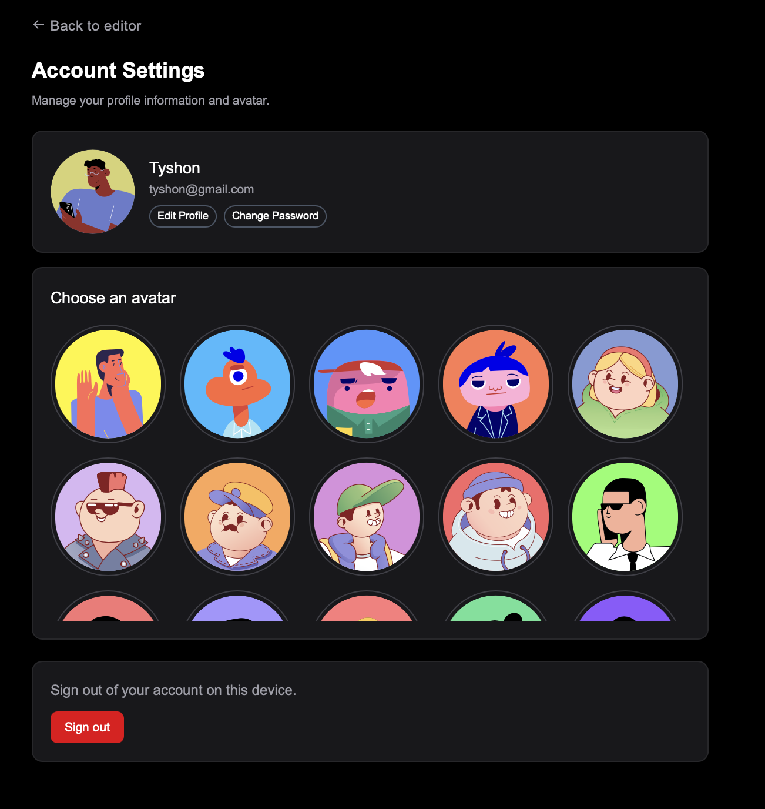

# devNotes

devNotes is a full-stack developer notes app that helps users create, organize, edit, and manage coding notes in a clean workspace. Users can write rich-text notes, organize them with categories and tags, pin important notes, search through saved content, and manage their account settings.

## Features

- User authentication with JWT
- Create, edit, and delete notes
- Rich-text editor with formatting tools
- Add categories to organize notes
- Add tags for better filtering
- Search notes by title, content, category, or tags
- Pin and unpin important notes
- Filter notes by category and tag
- Sort notes by newest, oldest, or title
- Auto-save note updates
- Account settings with username, email, password, and avatar updates

## Tech Stack

- Next.js
- TypeScript
- Tailwind CSS
- Node.js
- Express
- MongoDB
- Mongoose
- JWT Authentication
- TipTap Editor

## Pages

### Landing Page


### Dashboard


### Account Settings


## Demo

devNotes allows users to create an account, sign in, and manage their own personal developer notes. Each user has their own notes, categories, tags, and account settings.

## What I Learned

While building devNotes, I practiced:

- Building a full-stack app with Next.js, Node.js, Express, and MongoDB
- Creating protected routes with JWT authentication
- Managing user-specific data in MongoDB
- Building reusable React and TypeScript components
- Working with rich-text editing using TipTap
- Implementing note search, filtering, sorting, and pinning
- Creating an auto-save editing experience
- Managing account settings and user profile updates
- Designing a responsive dashboard layout with Tailwind CSS
- Handling frontend and backend form validation

## Future Improvements

- Mobile-friendly dashboard
- Add note folders
- Add markdown export for notes

## Live Demo

devNotes will be available here once deployed:


## Installation

Clone the repository:

```bash
git clone https://github.com/tyshonbrown/devNotes.git
